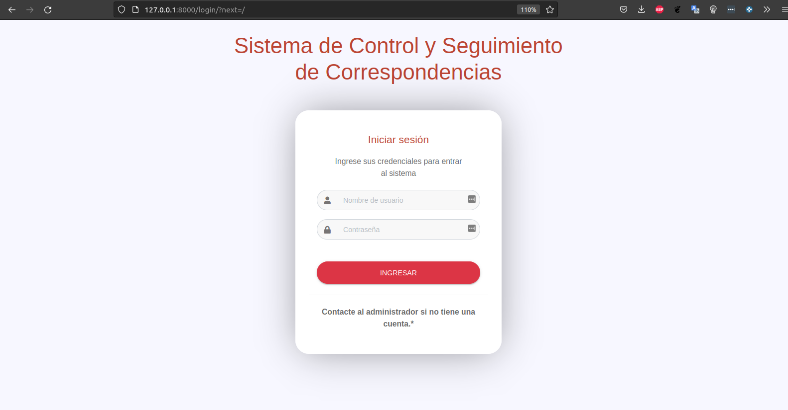

# Sistema de Control y Seguimiento de Correspondencias

## Prerrequisitos

- Clonar el repositorio:
   ```shell
   $ git clone https://github.com/Felipe322/SCSC.git
   $ cd SCSC
   ```

-  **Es necesario crear el archivo *.env* dentro de la carpeta  /correspondencias y declarar las variables como en el archivo *.env.example* con valores de la base de datos y un correo válido.**


- Instalamos Docker. La manera recomendada para implementar este sistema es utilizando [Docker](https://www.docker.com/), para instalarlo puedes seguir las instrucciones para cada sistema operativo haciendo clic [aquí](https://docs.docker.com/install/). Antes de continuar con los siguientes comandos es necesario tomar en cuenta que las pruebas se realizaron bajo la versión 20.10.18 de Docker y Docker Compose version v2.10.2. 


- Una vez instalado docker debemos ejecutar el siguiente comando en la consola para que se descarguen las imágenes necesarias y se ejecuten (verificar que el servicio de Docker se encuentra corriendo):

   ```shell
   $ sudo docker compose up -d
   ```

## Desarrollo

Para trabajar con la aplicación en modo desarrollador, realizamos los siguientes comandos:

- Esto nos permite entrar al contenedor de docker donde tenemos la aplicación de Django corriendo:
  ```shell
   $ sudo docker exec -it correspondencia_app bash
   ```

- Dentro del contenedor corremos los siguientes comandos para sincronizar la base de datos:
  ```shell
   root@4946b745b45d:/app# python3 manage.py makemigrations usuarios
   root@4946b745b45d:/app# python3 manage.py makemigrations ficha
   root@4946b745b45d:/app# python3 manage.py migrate
   ```
   O puedes correr los el siguiente aleas:
   ```shell
   root@4946b745b45d:/app# mig
   ```

- Para crear un usuario administrador y poder entrar al sistema, ejecutamos el siguiente comando:

  ```shell
   $ python3 manage.py createsuperuser
   ```
   O puedes correr los el siguiente aleas:
   ```shell
   root@4946b745b45d:/app# cs
   ```

- Por ultimo ejecutamos el siguiente comando para iniciar la aplicación de Django:
  ```shell
   $ python3 manage.py runserver 0.0.0.0:8000
   ```
   O puedes correr los el siguiente aleas:
   ```shell
   root@4946b745b45d:/app# run
   ```

- Si los comandos fueron exitosos, podremos ingresar a nuestro navegador y verificar que el sistema se ha iniciado con éxito, para esto, ingresamos a la siguiente url: 

    - ip: La ip es el equipo local (localhost).

   > http://127.0.0.1:8000
 
#### Deberas ser capaz de ver la siguiente pestaña



### Comandos para desarrollo


- Ver los contenedores que están corriendo en docker:
   ```shell
   $ sudo docker ps
   ```

- Entra al contenedor indicado y abre una terminal de forma interactiva.
   ```shell
   $ sudo docker exec -it <nombre_contenedor/id_contenedor> bash
   ```

- Ver el estado de los contenedores del archivo docker-compose.yml.
   ```shell
   $ sudo docker compose ps
   ```

- Detener todos los contenedores corriendo del archivo docker-compose.yml.
   ```shell
   $ sudo docker compose stop
   ```

Puedes consultar más información sobre los comando de docker [aquí](https://docs.docker.com/engine/reference/commandline/docker/).


### Versión

1.1.3 - Octubre 2022

### Autores
* **Felipe de Jesús Delgado Troncoso**
* **Eduardo Santana Cabrera**
